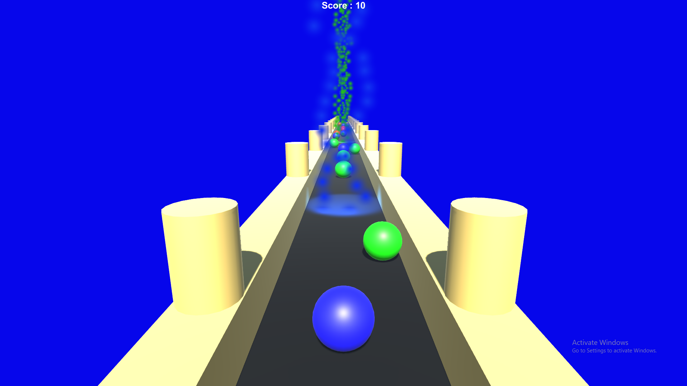

<h1 align=center> Infinite Runnner </h1>

	

## Overview
An infinite runner game in which the player will try to maximize his score by gathering collectibles of only his ball's color. The color of the player ball changes after passing through color changers. As the score of the player increases the speed increases as well.

### Built With:
- [**Unity**](https://unity3d.com/): Unity is a cross-platform game engine developed by Unity Technologies

### Running the game:
One can run the game on Windows, Max, Linux & Android operating systems. The builds are included in the corresponding folders.
